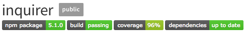

# Programmer's-Loop with Inquirer Npm Pacakge

A Node [Console](https://en.wikipedia.org/wiki/Console_application) application.  Creating an object using a constructor.

# Built With
* [NPM Package](https://www.npmjs.com/package/inquirer) Inquirer to collect data.

